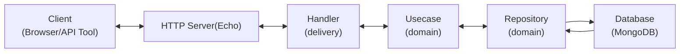
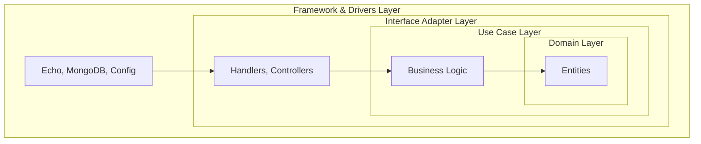

# Go Book Store - Project Structure

This README explains the architecture and structure of the Go Book Store application, which follows a clean architecture pattern.

## Architecture Diagram

```
go-book-store/
├── cmd/                    # Application entry points
│   └── api/                # HTTP API server
│       └── main.go         # Main application entry point
├── config/                 # Configuration management
│   └── config.go           # Application configuration
├── internal/               # Private application code
│   ├── bootstrap/          # Application initialization
│   │   ├── app.go          # Main application setup
│   │   ├── http.go         # HTTP server setup
│   │   ├── repository.go   # Repository initialization
│   │   └── usecase.go      # Use case initialization
│   ├── delivery/           # Interface adapters (controllers)
│   │   └── http/           # HTTP delivery
│   │       ├── handler/    # HTTP handlers
│   │       └── middleware/ # HTTP middleware
│   └── domain/             # Enterprise business rules
│       ├── entity/         # Business entities
│       ├── repository/     # Repository interfaces
│       │   └── mocks/      # Repository mocks for testing
│       └── usecase/        # Use case implementations
├── pkg/                    # Public libraries
│   └── mongodb/            # MongoDB utilities
├── .air.toml               # Air configuration for hot reload
├── docker-compose.yml      # Docker Compose configuration
├── dockerfile              # Docker configuration
└── makefile                # Build automation
```

## Component Descriptions

### 1. `cmd/`
Contains the application entry points. The `api/main.go` initializes and starts the HTTP server.

### 2. `config/`
Manages application configuration, including environment variables for MongoDB connection, HTTP server settings, etc.

### 3. `internal/`
Contains the core application code, organized according to clean architecture principles:

#### 3.1 `bootstrap/`
Responsible for initializing and wiring together all application components:
- `app.go`: Main application setup and lifecycle management
- `http.go`: HTTP server configuration and route registration
- `repository.go`: Database repository initialization
- `usecase.go`: Business logic initialization

#### 3.2 `delivery/`
Interface adapters that handle external communication:
- `http/handler/`: HTTP request handlers that convert HTTP requests to use case calls
- `http/middleware/`: HTTP middleware for cross-cutting concerns like logging, authentication

#### 3.3 `domain/`
Contains the core business logic:
- `entity/`: Business entities (e.g., User, Book)
- `repository/`: Repository interfaces for data access abstraction
- `usecase/`: Business logic implementation

### 4. `pkg/`
Reusable packages that could potentially be used by other applications:
- `mongodb/`: MongoDB connection and utility functions

### 5. Docker Configuration
- `docker-compose.yml`: Defines services (app and MongoDB)
- `dockerfile`: Builds the application container

## Data Flow

1. HTTP requests are received by the Echo server in `bootstrap/app.go`
2. Requests are routed to appropriate handlers in `delivery/http/handler/`
3. Handlers call use cases in `domain/usecase/`
4. Use cases implement business logic and call repositories
5. Repositories in `domain/repository/` handle data access to MongoDB
6. Responses flow back through the same layers

## Flow Diagram



## Clean Architecture Layers



## Environment Configuration

The application uses environment variables for configuration, which are set in the `docker-compose.yml` file:

- MongoDB connection details
- HTTP server port
- Collection names

## Development Tools

- Hot reloading with Air
- Mockery for generating test mocks
- Docker and Docker Compose for containerization

This architecture follows clean architecture principles, ensuring separation of concerns and making the codebase maintainable, testable, and scalable.
